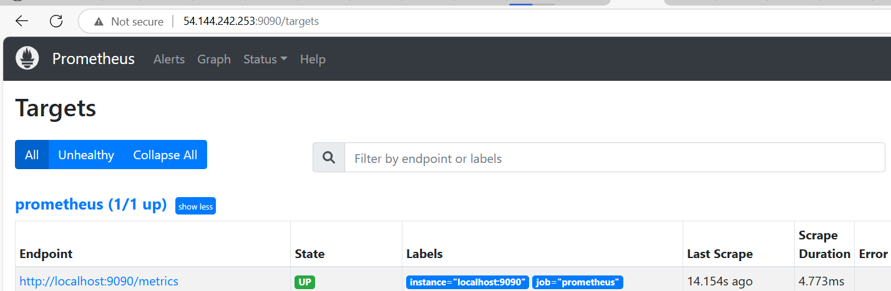
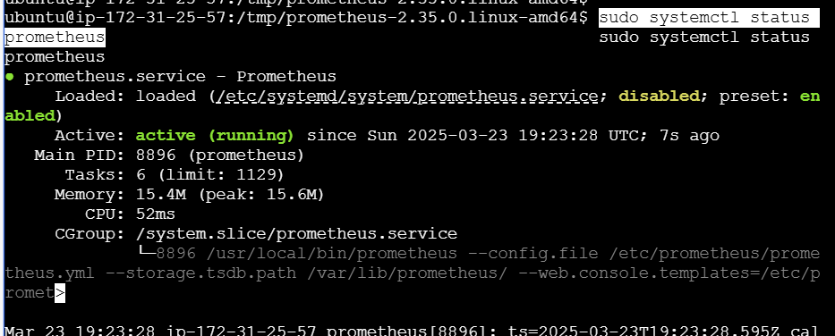
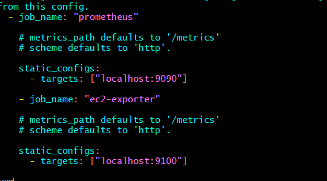
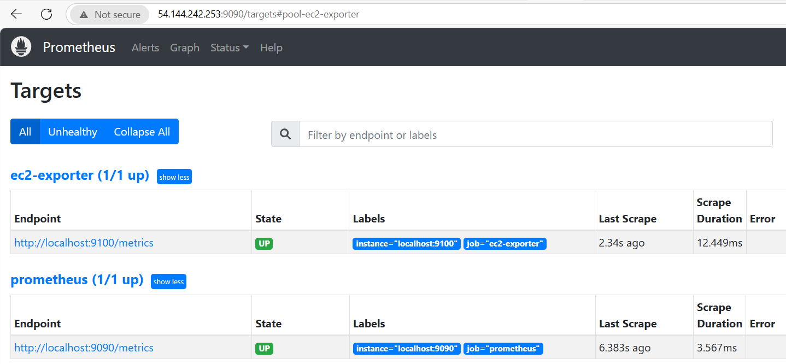
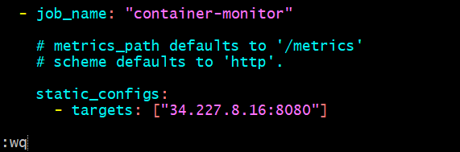

# Day1

## 1.HTTP Status Code Categories

### 1xx – Informational  
**Temporary responses before the final response**

### 2xx – Success  
**Request was successfully received, understood, and accepted**

### 3xx – Redirection  
**Client needs to take further action**

### 4xx – Client Errors  
**The request contains errors from the client's side**

### 5xx – Server Errors  
**The server failed to process a valid request**

## 2.What database is used by Prometheus?
**Prometheus uses TSDB (Time Series Database) as its built-in storage engine.**

## 3.what is the differnece between different metrics types ( counter , gauge , histogram)
### counter:
**it's a metric that can only increase or reset to zero, it's perfect for tracking things that only go up like the number of http requests**

### gauge:
**it's a metric that can increase or decrease, they are used for measuring values that can fluctuates up and down like memory/cpu usage**

### histogram:
**it's a metric that measure the distribution of values over a set of buckets**

##  4.install prometheus on your localhost or on server in any cloud provider 
  

##  5.add any new target to prometheus.yaml  file to monitor different server and run any query on it using promql langauge 

##  6.monitor running containers on different server than prometheus one 

